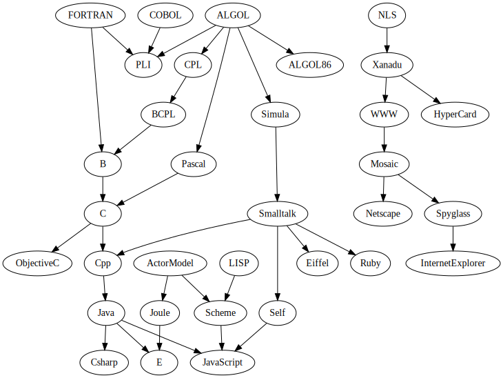

[https://www.youtube.com/watch?v=JxAXlJEmNMg](https://www.youtube.com/watch?v=JxAXlJEmNMg)

Crockford on JavaScript - Volume 1: The Early Years

Punchcards had 80 character limits - rollover to 80 char terminal limits

Assembly language - Crockford not sure why it's called that, etomology lost(?)

Bugs were invented by Edison: "Mr Edison, I was informed, had been up the two perious nights diccovering a bug in his phonograph" - Pall Mall Gazelle, 1889-03-11

Grace Hopper's Bug - a moth in the relay 


Batch processing was used to optimise machine time, not human time

Backspace and Delete
 - backspace does back
 - delete deletes - punches out a big block of 1s - interpreter knows to ignore that

TeleType machine - put a voice widget on the wire to translate

Character sets: 
 - ASCII (or half-ascii (because only uppercase))
 - National Character Sets
 - UNICODE
 - UTF-8

Carriage Return and Linefeed
 - modelling how teletypes work
 - carriage return - moves the carriage back to the left
 - linefeed - rolls the line up
 - hence, crlf
 - "multually disagreeable compromise"

Batch vs Timesharing
 - TS was optimised for human time
 - Batch arguments - "TS was a fad" "Disipline"

Social Timesharing
 - file sharing, email, distrbuted computing, computing as a service, chat, blogs, OS development, games, security
 - All these things happened in the 60s and 70s

Algorithm, UX Design all motivated by games

Shared memory issues -> security

Edit -> Teco -> Emacs
 \-> VI
 -- dinosaurs leftover from the timesharing era

H - left, J- Down, K- Up, L- right < on terminal machines, these letters had actual arrows :D

3270 - 'intelligent' terminal - ascii input forms :D

Doug Engelbart - The Mother of All Demos 1968
 - Hypertext
 - video conferencing
 - todo lists
 - outline processing 
 - the mouse
 - https://www.youtube.com/watch?v=yJDv-zdhzMY


Mini computers, micro computers
 - intel and datapoint
 - logic on a chip -> 8 bit cpu architecture

Personal computing
 - you had the machine to do all the things (no more timeshare)

16 bit generation - e.g. Intel 432, Z8000
 - intel 432 - garbage collection in the cpu, made for Ada
 - split out to two chips, slow
 
Z80 v 8096 v 386
 - 8 v 16 v 32
 - v. similar register designs - compatibility

Intel arch. is the worst cpu architecutre

Programmers didn't want the new shiny architecture, they wanted the thing they were used to, even if it's awful

Moore's law is a self-fulfilling prophesy

the end of innovation
 - intel, powerpc, arm for cpu
 - operating systems - unix 70s, windows 80s


Innovation is happening in the programming languages

automatic programming - high level languages
 - tell the machine what the program should do and it'll write itself
 - resulted in Fortran
 - it's still a program, but it's abstraction

domain specific languages
 - you're still programming, possibly at a more productive/appropriate level


cobol - delveoped by grace hopper

basic - stripped down fortran
 - best string processing

basic -> microsoft basic -> visual basic

VB was the most popular language in the world for a while

ALGOL 60
 - best designed by committee in the history of programming languages
 - introduced blocks - used 'begin' and 'end' (curly braces were invented later)

Structured Programming
 - GOTO considered harmful - Djisktra
 - very contencious at the time
 - debate raged for a decade

fortran -> scientific processing
cobol -> business processing

 - an uberlanguage was sort after

ALGOL -> pascal
 - ignored the ALGOL68 direction
 - pascal was extremely popular, designed as a teaching langauge
 - design problems 
  - wasn't modular
  - type system - the dimension of an array was part of it's type




Atari 2600 VCS
 - 6502 CPU
 - 128 bytes RAM
 - 4K cartridge
 - no software or firmware
 - you can't do this in aynthing other than assembly
 - pro: you get your program in millions of jomes

Simula -> Smalltalk 


Xerox and Smalltalk
 - Bitmap displays, window systems
 - local area network
 - ethernet
 - tried to commercialise, but Xeros didn't realise what their labs had developed

Smalltalk not commerically viable, but an influencer

OO Programming
 - 1967 similar
 - 1972 Kay begins smalltakl
 - 1980 smalltakl released
 - 1985 C++ programming langauge
 - 1995 java programming language

Leaps
 - plugboards
 - symbolic assembly langague
 - high level languages
 - structured programming
 - oo programming

We have to wait for a generation to retire before we can adopt new ideas

Smalltalk influcenced Self
 - better garbage correction
 - V8 (google)
 - prototypes

The Actor Model 
 - what if "send a message" meant "send a message"
 - scales well 
 - security encaspulation
 - async
 - message queue

LISP - 1958
 - tail recursion - thing can never return without breaking memory 
 - lexical closure
 - refined into scheme

Scheme influenced a heap of stuff
 - including Common Lisp

Actor Model -> Joule; Java + Joule -> E
 - The object capability Model

Smalltalk + Dynobook + SteveJobs -> Macintosh

HyperCard - 1993
 - database + a small scripting language
 - fileformat of visual dplay
 - Stack, Background, Card, Button, Field
 - IDE to make buttons and stuff

HyperTalk 
```
on mouseUp
 	put "100,100" into pos
	repeat with x = 1 to the number of card bttons
		set the laocation of card button x to pos
		add 15 to item 1 of pos
	end repeast
end mouseUp
```

Cons: 
 - component nesting - can't see the whole program

Pros: 
 - script travels with button

Bill Atkinson was colourblind - monochrome stack

Hypercard didn't anticipate
 - colour (mac was b&w)
 - text links ( 
 - networking (floppydisk)

Engelbart's Mother of all Demos -> NLS 
 -> influenced Xanadu 
 -> Xanadu slightly influenced hypercard (literally the 'hyper' in hypertext)
 -> Xanadu influenced WWW very very slightly.

Mosaic 
 - could render all the different implementations
 - image tags - made to be look like what everyone wanted

Mosaic splitup into two startups 
 - netscape and spyglass
 - spyglass bought by microsoft after netscape said they'd be awesomer than microsoft

Brendan Eich 
 - "I wanna write scheme" 'No, make it look like Java"
 - Syntax of Java, Function Model of Scheme, Prototypal objects of Self => JavaScript
 - "It's a shame he didn't have 10 years to get it write"
 - "Netscape didn't have time to get it right, and that's why there's no longer a netscape"

JavaScript is horrible, but has some brilliant parts

Java was supposed to be the language of the Web
 - Java Applets 1995
 - java server side

"It's just luck, it's in the browser" - not nessesarily. See next episode. 


Babel (1969) - Programming Language - History and Fundamentals
 - > 100 languages
 - we are not in another period of langauge design innocation
 - haskell, erlang, scala

We need to be open to be new ideas. We should reject them just because we don't understand them
